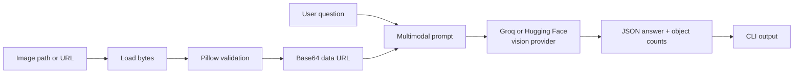

# Day2 — Multimodal Visual QA Tool

A small Python command-line tool that accepts a local or online image, encodes it as a Base64 data URL, sends it with a natural-language question to a hosted vision model, and prints a structured answer with object counts. It supports Groq and Hugging Face Inference Providers.

## Architecture



## What this demonstrates

- Vision-language question answering.
- Local image and HTTP(S) URL input.
- Pillow image validation.
- Base64 encoding for a multimodal request.
- Structured JSON output with an answer and object counts.
- Safe image-size limits and missing-key errors.
- Unit tests that mock the provider API, so tests do not spend API quota.

## Requirements

- Python 3.10 or newer.
- A Groq API key or Hugging Face token for real vision requests.
- Internet access for URL images and the Groq API.

Provider access and model availability can change. The Groq default is `llama-3.2-11b-vision-instruct`. The Hugging Face default is `Qwen/Qwen2.5-VL-7B-Instruct`, which currently has a live Inference Provider mapping. You can override either with `--model`.

## Windows setup

```powershell
py -m venv .venv
.\.venv\Scripts\python.exe -m pip install --upgrade pip
.\.venv\Scripts\python.exe -m pip install -r requirements.txt
```

## Set a provider credential

PowerShell, for the current terminal window only:

```powershell
$env:GROQ_API_KEY = "your-groq-api-key"
```

For Hugging Face Inference Providers, create a fine-grained token with **Make calls to Inference Providers** permission, then set:

```powershell
$env:HF_TOKEN = "hf_your-token"
```

Command Prompt:

```cmd
set GROQ_API_KEY=your-groq-api-key
```

Never commit the key to GitHub.

Hugging Face routed requests use the Hugging Face token and may use monthly credits or provider limits. Check the current [Inference Providers pricing](https://huggingface.co/docs/inference-providers/en/pricing). Hugging Face supports multiple providers through one interface, but a particular model must currently be available through an eligible provider.

## Run with a local image

```powershell
.\.venv\Scripts\python.exe vision_qa.py "C:\Users\YourName\Pictures\scene.jpg" "What objects are visible in this image?"
```

To use Hugging Face instead of Groq:

```powershell
.\.venv\Scripts\python.exe vision_qa.py "C:\Users\YourName\Pictures\scene.jpg" "What objects are visible in this image?" --provider huggingface
```

For machine-readable output:

```powershell
.\.venv\Scripts\python.exe vision_qa.py "C:\Users\YourName\Pictures\scene.jpg" "Count the visible objects." --json
```

Example response shape:

```json
{
  "answer": "The image shows a table with several objects on it.",
  "objects": {
    "table": 1,
    "chair": 2,
    "cup": 1
  },
  "model": "llama-3.2-11b-vision-instruct",
  "source": "C:\\Users\\YourName\\Pictures\\scene.jpg"
}
```

## Run with an online image

```powershell
.\.venv\Scripts\python.exe vision_qa.py "https://example.com/image.jpg" "Describe the main subject and its surroundings."
```

The URL must return an actual supported image: JPEG, PNG, WEBP, or GIF. The default maximum size is 10 MB.

## Run tests

The tests create a small local image and use a mocked provider client. No API key is needed:

```powershell
.\.venv\Scripts\python.exe -m pytest -q
```

## Important implementation details

The tool sends the selected vision model a message containing two content parts:

1. A text prompt asking for a grounded answer in JSON.
2. A Base64 `data:image/...` URL containing the image.

The model is instructed not to guess objects that are not visibly supported. The parser accepts direct JSON and JSON inside a Markdown code fence, then validates the answer and object counts.

## Limitations and next steps

This is a learning prototype, not a production image moderation or safety system. A future version could add a web interface, image resizing, conversation history, source metadata, retry and timeout policies, request logging, authentication, and a human-review path for uncertain visual answers. Do not upload private or sensitive images without reviewing the selected provider's current privacy and retention terms.

## License

MIT. The test image is generated locally during testing; no copyrighted image asset is included.
